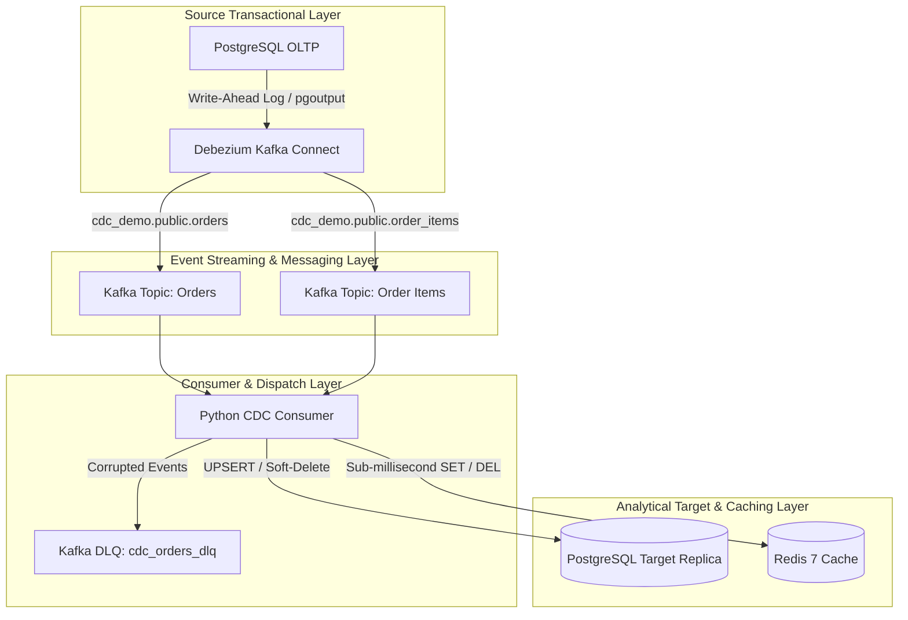

    # 🚀 Real-Time Log-Based CDC Pipeline & Microsecond Caching Engine

A production-grade, event-driven Change Data Capture (CDC) streaming pipeline designed for e-commerce transactional workloads. Built using **PostgreSQL**, **Debezium**, **Apache Kafka (KRaft mode)**, **Redis**, and a custom **Python Consumer** featuring **Soft-Delete Tracking**, **Dead Letter Queue (DLQ)** fault tolerance, and **In-Memory Cache Ingestion**.

---

## 🏗️ System Architecture



---

## ✨ Key Features & Engineering Decisions

* **Log-Based CDC (Zero DB Triggers)**: Streams low-latency database changes using PostgreSQL Write-Ahead Logs (`pgoutput` plugin) without impacting OLTP database performance.
* **Soft-Delete Conversion**: Converts physical source database deletions into logical soft-deletes (`is_deleted = TRUE`, `deleted_at = NOW()`) on the analytical target replica to preserve auditability.
* **Dead Letter Queue (DLQ)**: Catches malformed JSON or schema mismatches gracefully and routes poison-pill events to `cdc_orders_dlq` without stopping consumer execution.
* **Sub-Millisecond Redis Cache Sync**: Automatically updates Redis cache keys (`order:{id}`) on create/update and invalidates keys on delete for microsecond API lookups.
* **Handler Dispatch Architecture**: Implements a functional handler map in Python for clean, extensible event routing across multiple Kafka topics.

---

## 🛠️ Technology Stack

* **Source Database**: PostgreSQL 16 (Logical Replication enabled)
* **Streaming Platform**: Apache Kafka 7.6 (KRaft mode - Zookeeper-less)
* **CDC Connector**: Debezium Connect 2.6
* **In-Memory Cache**: Redis 7
* **CDC Consumer & Scripting**: Python 3.10+, `confluent-kafka`, `psycopg2`, `redis-py`, `faker`
* **Containerization**: Docker Compose

---

## 📂 Project Structure

```text
├── docker-compose.yml           # Infrastructure orchestration (Postgres, Kafka, Debezium, Redis, Kafka UI)
├── kafka-connection/
│   └── connection.json          # Debezium PostgreSQL connector configuration
├── sql/
│   ├── postgres-init.sql        # Source database schema & replication setup
│   └── target-init.sql          # Target analytical schema (Soft-delete & audit columns)
├── scripts/
│   ├── connection.py            # Environment-aware database connection setup
│   ├── feeder.py                # Transaction simulator generating CRUD operations
│   └── cdc_consumer.py          # CDC Consumer (Multi-topic, DLQ, Soft-Delete, Redis Cache)
└── README.md
```

---

## 🚀 Quickstart Guide

### 1. Launch Infrastructure
Start all streaming services in Docker:
```bash
docker compose up -d
```

### 2. Register Debezium Connector
Register the PostgreSQL CDC connector with Kafka Connect:
```bash
curl -i -X POST -H "Accept:application/json" -H "Content-Type:application/json" \
  http://localhost:8083/connectors/ -d @kafka-connection/connection.json
```

### 3. Start Python Environment
Install required Python dependencies:
```bash
pip install confluent-kafka psycopg2-binary redis faker python-dotenv
```

### 4. Run Transaction Feeder
Simulate live e-commerce transactions:
```bash
python scripts/feeder.py
```

### 5. Run CDC Consumer
Start the real-time Python consumer:
```bash
python scripts/cdc_consumer.py
```

---

## 🔍 Verification & Inspection

### Check Target Database Sync & Soft-Deletes
Run in PostgreSQL to verify synced analytical data:
```sql
SELECT id, customer_id, total_amount, status, is_deleted, deleted_at, synced_at 
FROM target_orders 
ORDER BY synced_at DESC 
LIMIT 10;
```

### Inspect Redis Real-Time Cache
Verify sub-millisecond cached records inside Redis CLI:
```bash
docker exec -it cdc_redis redis-cli GET "order:1"
```
